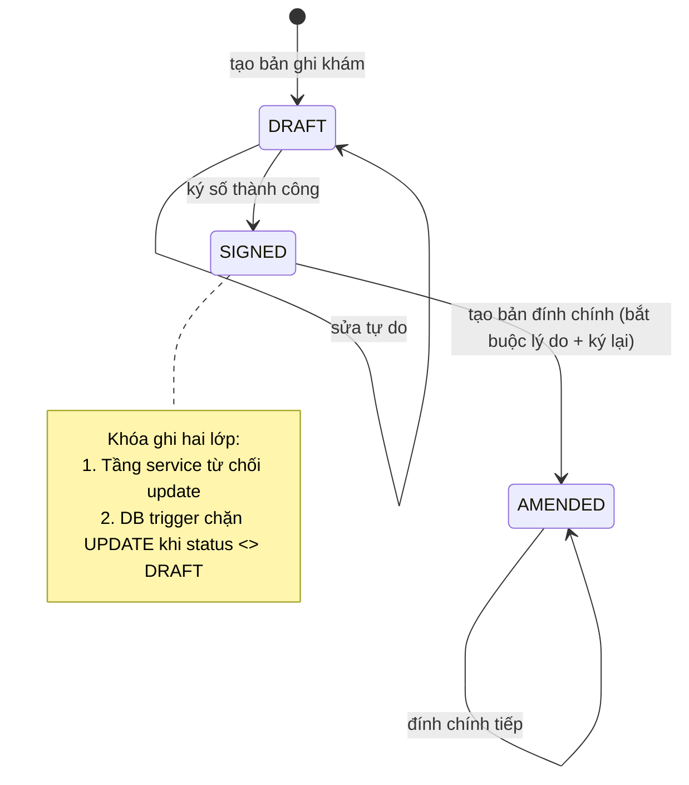
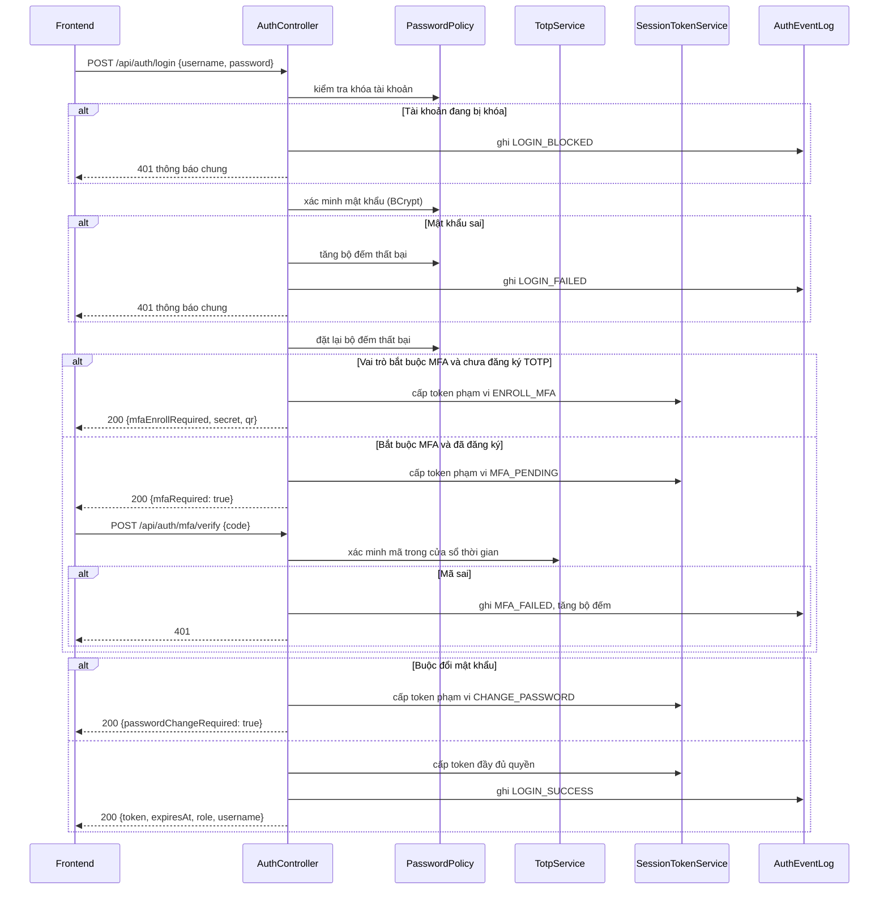
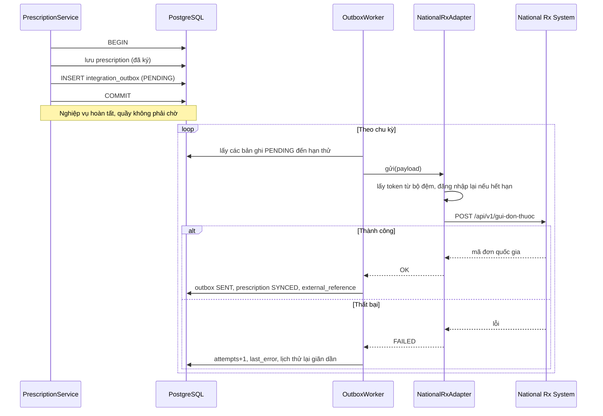
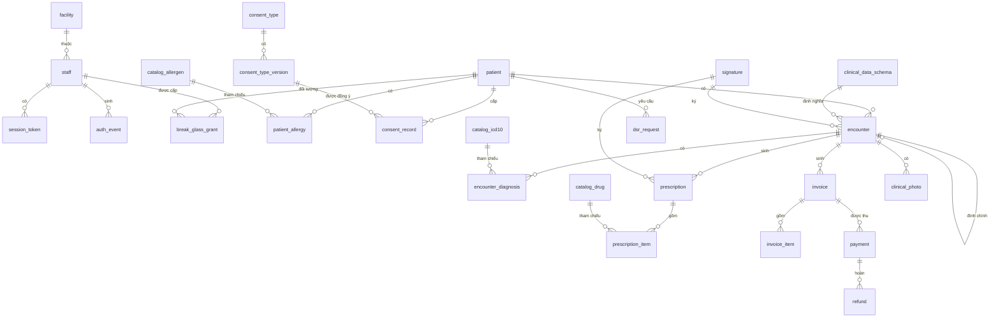

# Design Document: Tuân thủ quy định Việt Nam (compliance-vn)

## Overview

Thiết kế này đưa s-clinic lên mức tuân thủ đầy đủ quy định Việt Nam, đồng thời hiện thực hóa các module còn ở dạng schema. Giữ nguyên kiến trúc hiện có (Spring Boot + JPA + Flyway backend, Vue 3 + TanStack Query + Vuetify frontend) và định hướng ports-and-adapters đã nêu trong README.

Ba trục bổ sung:

1. **Trục dữ liệu**: thêm `Facility` làm gốc định danh cơ sở, làm giàu `Patient` theo mẫu hồ sơ bệnh án, cấu trúc hóa dị ứng, thêm danh mục dùng chung.
2. **Trục bất biến**: mọi bản ghi lâm sàng theo vòng đời DRAFT đến SIGNED đến AMENDED. Ký qua port `DigitalSignatureProvider`. Sau khi ký thì khóa ghi ở cả tầng service và DB trigger.
3. **Trục tích hợp**: dùng lại bảng `integration_outbox` đã có trong V2. Một `OutboxWorker` đọc bản ghi chờ và đẩy qua adapter tương ứng.

Các quyết định thiết kế chính:

- **Opaque session token thay HTTP Basic**: token lưu server-side dưới dạng hash, cho phép thu hồi tức thì. Chọn opaque thay vì JWT vì yêu cầu thu hồi ngay là bắt buộc với dữ liệu y tế, còn JWT stateless không thu hồi được trước khi hết hạn.
- **Hash chain cho audit log**: mỗi dòng chứa hash của dòng trước. Kết hợp thu hồi quyền UPDATE/DELETE ở cấp DB role. Hai lớp này bù cho nhau: DB grant chặn thao tác thông thường, hash chain phát hiện can thiệp ở cấp cao hơn.
- **Xóa mềm bắt buộc**: bỏ hoàn toàn hard delete khỏi API nghiệp vụ. Việc xóa vĩnh viễn chỉ diễn ra qua bộ máy tiêu hủy có phê duyệt.
- **Care relationship cho phân quyền**: bác sĩ chỉ thấy bệnh nhân có quan hệ điều trị, mở rộng bằng break-glass có thời hạn thay vì cấp quyền rộng vĩnh viễn.
- **Mã hóa ở tầng ứng dụng cho cột định danh**: dùng JPA `AttributeConverter` để mã hóa `national_id`, `insurance_no`, `tax_code`. Chọn tầng ứng dụng thay vì `pgcrypto` để khóa không bao giờ đi qua câu lệnh SQL và không nằm trong log của DB.
- **JSON Schema có phiên bản cho clinical_data**: giữ được tính linh hoạt đa chuyên khoa mà vẫn validate được, đồng thời bản ghi cũ không vỡ khi schema lên phiên bản.

## Architecture

```mermaid
graph TB
    subgraph FE ["s-clinic-web (Vue 3)"]
        LoginPage["LoginPage + MFA"]
        PatientPages["Patient pages"]
        EncounterPage["Encounter page"]
        RxPage["Prescription page"]
        CashierPage["Cashier page"]
        ConsentUI["Consent capture"]
        AdminUI["Admin: facility, audit, DSR"]
    end

    subgraph Auth ["Xác thực và phân quyền"]
        AuthController["AuthController"]
        SessionService["SessionTokenService"]
        TotpService["TotpService"]
        PasswordPolicy["PasswordPolicy"]
        AccessGuard["PatientAccessGuard"]
        BreakGlass["BreakGlassService"]
    end

    subgraph Core ["Nghiệp vụ lõi"]
        FacilityService["FacilityService"]
        PatientService["PatientService (sửa)"]
        ConsentService["ConsentService"]
        AllergyService["AllergyService"]
        CatalogService["CatalogService"]
        EncounterService["EncounterService"]
        PrescriptionService["PrescriptionService"]
        BillingService["BillingService"]
        PhotoService["ClinicalPhotoService"]
        CourseService["TreatmentCourseService"]
        DsrService["DsrService"]
        RetentionService["RetentionService"]
    end

    subgraph Sign ["Ký số"]
        SignPort["DigitalSignatureProvider (port)"]
        SmartCa["VnptSmartCaAdapter"]
        UsbToken["UsbTokenAdapter (dự phòng)"]
    end

    subgraph Audit ["Audit"]
        AuditService["AuditService (sửa)"]
        ChainVerifier["AuditChainVerifier"]
    end

    subgraph Integration ["Tích hợp"]
        Outbox[("integration_outbox")]
        Worker["OutboxWorker"]
        RxAdapter["NationalRxAdapter"]
        EInvAdapter["VnptEInvoiceAdapter"]
    end

    subgraph Ext ["Hệ thống ngoài"]
        NationalRx["National Rx System"]
        VnptEInv["VNPT e-invoice"]
        VnptCa["VNPT SmartCA"]
        Storage["Private object storage"]
    end

    subgraph DB [("PostgreSQL")]
        Tables["facility, patient, staff, session_token,<br/>auth_event, audit_log, consent_*, patient_allergy,<br/>catalog_*, encounter, signature, prescription_*,<br/>invoice_*, payment, clinical_photo, dsr_request"]
    end

    LoginPage --> AuthController
    PatientPages --> PatientService
    EncounterPage --> EncounterService
    RxPage --> PrescriptionService
    CashierPage --> BillingService
    ConsentUI --> ConsentService
    AdminUI --> FacilityService
    AdminUI --> ChainVerifier
    AdminUI --> DsrService

    AuthController --> SessionService
    AuthController --> TotpService
    AuthController --> PasswordPolicy
    PatientService --> AccessGuard
    AccessGuard --> BreakGlass

    EncounterService --> SignPort
    PrescriptionService --> SignPort
    SignPort --> SmartCa
    SignPort -.-> UsbToken
    SmartCa --> VnptCa

    PrescriptionService --> Outbox
    BillingService --> Outbox
    Outbox --> Worker
    Worker --> RxAdapter
    Worker --> EInvAdapter
    RxAdapter --> NationalRx
    EInvAdapter --> VnptEInv

    PhotoService --> Storage
    PhotoService --> ConsentService
    CourseService --> ConsentService

    Core --> AuditService
    Auth --> AuditService
    AuditService --> DB
    Core --> DB
    Auth --> DB
```

## Vòng đời bản ghi lâm sàng



## Luồng đăng nhập có MFA



## Luồng tích hợp qua outbox



## Components and Interfaces

### Facility (Task 1)

- `Facility` entity, bảng `facility`. Trường: `name`, `kcbCode`, `interopCode`, `taxCode`, `address`, `licenseNo`, `licenseIssuedAt`, `technicalDirector`, `phone`, `email`, `einvoiceTemplateCode`, `einvoiceSerial`, `einvoiceUnitCode`, timestamps.
- `FacilityRepository extends JpaRepository<Facility, UUID>`.
- `FacilitySeeder implements CommandLineRunner`: tạo bản ghi đầu tiên từ `sclinic.facility.*` nếu bảng rỗng. Idempotent theo `count() > 0`, cùng khuôn mẫu `AdminSeeder` hiện có.
- `FacilityService`: `getCurrent()`, `update(request)` kèm audit.
- `FacilityController`: `GET /api/facility` cho mọi người dùng đã xác thực, `PUT /api/facility` chỉ ADMIN.
- `FacilityRequest`, `FacilityResponse` là record. `FacilityMapper` dùng MapStruct.

Lý do có một bảng thay vì đặt trong `application.yml`: mã cơ sở và cấu hình hóa đơn cần sửa được lúc chạy bởi ADMIN, cần audit khi thay đổi, và sẽ cần nhiều bản ghi nếu phòng khám mở thêm chi nhánh.

### Xác thực (Task 2, 3)

- `session_token`: `id`, `staff_id`, `token_hash`, `scope`, `issued_at`, `expires_at`, `revoked_at`, `ip`, `user_agent`.
- `auth_event`: `id`, `username`, `staff_id`, `event_type`, `result`, `ip`, `user_agent`, `created_at`, `detail`.
- Bổ sung `staff`: `password_changed_at`, `must_change_password`, `failed_attempts`, `locked_until`, `totp_secret`, `totp_enabled`, `totp_confirmed_at`.
- `staff_password_history`: chặn dùng lại mật khẩu cũ.
- `staff_backup_code`: mã dự phòng dùng một lần, lưu dạng hash.
- `SessionTokenService`: sinh token ngẫu nhiên 256 bit, lưu SHA-256 của token, xác minh và thu hồi.
- `SessionTokenAuthFilter`: đọc header `Authorization: Bearer`, phân giải thành `Authentication`.
- `TotpService`: TOTP theo RFC 6238, cửa sổ lệch cho phép ±1 bước.
- `PasswordPolicy`: kiểm tra độ mạnh và lịch sử.
- Token có `scope` để mô hình hóa các trạng thái trung gian: `ENROLL_MFA`, `MFA_PENDING`, `CHANGE_PASSWORD`, `FULL`. Chỉ `FULL` truy cập được endpoint nghiệp vụ.

Frontend phải sửa `src/infra/apiClient.ts` (bỏ `btoa` Basic, chuyển sang Bearer) và `src/app/authStore.ts` (lưu token và `expiresAt` thay vì cặp tên đăng nhập và mật khẩu). Giữ nguyên nguyên tắc chỉ lưu trong bộ nhớ, không ghi vào localStorage.

### Audit bất biến (Task 4)

- Bổ sung `audit_log`: `ip`, `user_agent`, `session_id`, `prev_hash`, `entry_hash`.
- `AuditService` tính `entry_hash = SHA256(prev_hash || staff_id || action || entity_type || entity_id || detail_canonical || created_at)`.
- `AuditChainVerifier`: quét theo `id` tăng dần, tính lại hash, trả về bản ghi đầu tiên lệch.
- Migration cấp một DB role riêng cho ứng dụng, `REVOKE UPDATE, DELETE ON audit_log`.
- `detail` chỉ lưu tên trường đã đổi và tham chiếu, không lưu giá trị cũ và mới dạng đọc được. Đây là thay đổi hành vi so với `AppointmentService` hiện tại, cần sửa cả chỗ đó.

Ghi chú kỹ thuật: `AuditService` đang chạy `REQUIRES_NEW`. Hash chain cần đọc bản ghi cuối nên phải tuần tự hóa việc ghi audit. Dùng advisory lock của PostgreSQL trên một khóa cố định để tránh hai transaction cùng đọc một `prev_hash`.

### Xóa mềm và lưu trữ (Task 5, 21, 29)

- Bổ sung các bảng thuộc diện lưu trữ: `deleted_at`, `deleted_by`, `delete_reason`, `retention_until`, `legal_hold`.
- `@Where(clause = "deleted_at is null")` không dùng vì cần đọc bản ghi đã xóa ở luồng quản trị. Thay vào đó dùng phương thức repository tường minh (`findByIdAndDeletedAtIsNull`) để tránh lọc ẩn gây khó gỡ lỗi.
- `RetentionPolicy`: bảng cấu hình thời hạn theo loại bản ghi, không hardcode. `[CẦN KIỂM CHỨNG]` giá trị mặc định phải xác nhận với văn bản.
- `disposal_record`: biên bản tiêu hủy.

### Mã hóa cột (Task 6)

- `EncryptedStringConverter implements AttributeConverter<String, String>`: AES-GCM, khóa từ `SCLINIC_DATA_KEY`, lưu dạng base64 kèm nonce.
- Migration đổi tên cột cũ, thêm cột mới, chạy chuyển đổi dữ liệu qua một job một lần, rồi bỏ cột cũ ở migration sau. Chia hai migration để có điểm quay lại.
- Không thể tìm kiếm theo giá trị đã mã hóa. Nếu cần tra theo CCCD, thêm cột `national_id_hash` chứa HMAC tiền tố để tìm chính xác.

### Phân quyền và break-glass (Task 7)

- `PatientAccessGuard`: quyết định theo vai trò và `Care_Relationship`.
- `Care_Relationship` xác định bằng truy vấn tồn tại appointment hoặc encounter giữa bác sĩ và bệnh nhân.
- `break_glass_grant`: `staff_id`, `patient_id`, `reason`, `granted_at`, `expires_at`.
- RECEPTIONIST thấy trường hành chính, không thấy `medical_history` và dữ liệu lâm sàng. Thực hiện bằng hai DTO response khác nhau thay vì lọc sau, để không có nguy cơ lộ do quên lọc.

### Ký số (Task 14, 15)

```java
public interface DigitalSignatureProvider {
    SignatureResult sign(SignRequest request);
    VerificationResult verify(UUID signatureId);
    String providerCode();
}
```

- `SignRequest`: hash dữ liệu cần ký, mã người ký, mục đích.
- `VnptSmartCaAdapter`: gọi API ký từ xa, hỗ trợ chờ người dùng xác nhận trên điện thoại.
- `signature`: `id`, `entity_type`, `entity_id`, `signer_staff_id`, `provider_code`, `algorithm`, `signed_hash`, `signature_value`, `certificate`, `signed_at`.
- Chọn adapter theo cấu hình `sclinic.signing.provider`.

### Danh mục và encounter (Task 11, 12, 13)

- `catalog_icd10`, `catalog_drug`, `catalog_allergen`, hoàn thiện `service`.
- `clinical_data_schema`: `specialty_code`, `version`, `json_schema`, `active`.
- `encounter_diagnosis`: nhiều chẩn đoán, cờ `is_primary`, ràng buộc partial unique index đảm bảo đúng một chẩn đoán chính mỗi encounter.
- Validate `clinical_data` bằng thư viện JSON Schema. Cần thêm dependency, sẽ ghim phiên bản cụ thể.

### Đơn thuốc (Task 17, 18, 19, 20)

- `Prescription_Code` 14 ký tự. Sinh bằng sequence trong DB để đảm bảo không trùng khi đồng thời, ghép với mã cơ sở và ký hiệu loại đơn.
- `AllergyChecker`: đối chiếu `catalog_drug` với `patient_allergy` qua `catalog_allergen`.
- `prescription_type`: NORMAL, PSYCHOTROPIC (N), NARCOTIC (H).
- `controlled_drug_ledger`: sổ theo dõi xuất nhập.
- `NationalRxAdapter`: đăng nhập lấy token có cache, gửi đơn, cập nhật `national_rx_code` và `sync_status`. Phân biệt rõ `prescription_code` nội bộ 14 ký tự với `national_rx_code` do hệ thống quốc gia trả về.

### Hóa đơn và thu tiền (Task 22, 23, 24)

- Bổ sung `invoice`: `template_code`, `serial`, `invoice_no`, `tax_authority_code`, `buyer_name`, `buyer_tax_code`, `buyer_address`, `buyer_email`, `vat_exempt`, `discount_amount`.
- `invoice_no` sinh bằng sequence, tuần tự, không trùng.
- Ràng buộc tổng tiền: dùng trigger kiểm tra `total = sum(invoice_item.amount)` sau mỗi thay đổi, thay vì cột sinh tự động vì cần hoạt động khi dòng thay đổi độc lập.
- `payment`, `refund`.
- `VnptEInvoiceAdapter` qua outbox.

### Ảnh lâm sàng (Task 26)

- Bổ sung `clinical_photo`: `content_hash`, `size_bytes`, `content_type`, `uploaded_by`, `photo_type`, `contains_face`.
- `ClinicalPhotoService`: kiểm tra consent trước khi cho tải lên, cấp signed URL hạn ngắn, ghi audit mỗi lần xem và tải.

## Data Model bổ sung



## Error Handling

Mở rộng `GlobalExceptionHandler` hiện có với các ngoại lệ mới:

| Ngoại lệ | Mã HTTP | Nội dung trả về |
|---|---|---|
| `ConsentRequiredException` | 403 | loại đồng ý còn thiếu |
| `BreakGlassRequiredException` | 403 | chỉ dẫn cần break-glass, id bệnh nhân |
| `RecordLockedException` | 409 | trạng thái bản ghi, hướng dẫn tạo đính chính |
| `SignatureFailedException` | 502 | mã lỗi từ nhà cung cấp, không lộ chi tiết nội bộ |
| `AllergyConflictException` | 409 | chất gây dị ứng trùng, mức độ |
| `RetentionConflictException` | 409 | căn cứ pháp lý từ chối xóa |
| `AccountLockedException` | 401 | thông báo chung, không nêu lý do cụ thể |
| `MfaRequiredException` | 401 | cờ cho frontend chuyển bước |

Nguyên tắc giữ nguyên từ hệ thống hiện tại: không lộ chi tiết lỗi phía server cho client, thông báo xác thực không tiết lộ tài khoản có tồn tại hay không.

## Testing Strategy

Giữ nguyên phong cách hiện có: jqwik cho property test ở backend, fast-check ở frontend, Mockito cho unit test service, domain logic thuần tách khỏi tầng Vue.

Bổ sung:

- **Testcontainers** cho integration test trên PostgreSQL thật. Cần thiết vì các migration dùng `jsonb`, `gen_random_uuid()`, partial index, trigger, và DB grant, không mô phỏng được trên H2.
- **Property test cho các bất biến quan trọng**:
  - Audit chain phát hiện mọi thao tác sửa hoặc xóa ở giữa chuỗi.
  - Không tồn tại đường nào sửa được bản ghi đã ký.
  - `Prescription_Code` luôn đúng 14 ký tự và không trùng khi sinh đồng thời.
  - Tổng tiền hóa đơn luôn khớp tổng dòng sau mọi chuỗi thao tác.
  - Tổng thu trừ tổng hoàn không vượt giá trị hóa đơn.
  - Giả danh hóa không để lọt định danh.
- **Test ma trận phân quyền**: bảng quyết định theo vai trò, quan hệ điều trị, và có hay không break-glass.
- **Test migration**: chạy toàn bộ V1 đến Vn trên DB trống, và kiểm tra `ddl-auto=validate` không báo lệch.

## Kế hoạch triển khai và rủi ro

| Rủi ro | Mức | Giảm thiểu |
|---|---|---|
| Task 2 thay cơ chế xác thực đang chạy | Cao | Làm trên branch riêng, sửa đồng bộ frontend, có kế hoạch quay lại, không chạm production |
| Task 6 chuyển đổi dữ liệu sang mã hóa | Cao | Sao lưu trước, chia hai migration, kiểm chứng trên staging |
| Task 4 thu hồi quyền DB làm hỏng luồng ghi audit | Trung bình | Kiểm thử tích hợp trên Testcontainers trước khi áp dụng |
| Chờ tài khoản môi trường kiểm thử VNPT và hệ thống quốc gia | Trung bình | Xin ngay từ đầu, phát triển trước với adapter mô phỏng |
| Bốn văn bản chưa đọc được | Trung bình | Dừng ở Task 8, 15, 17, 19 và xác nhận với chủ phòng khám trước khi code |

## Thứ tự phụ thuộc

Giai đoạn 0 (Task 1 đến 7) xong trước tất cả, trong đó Task 1 và 2 là nền. Giai đoạn 1 (Task 8 đến 11) chặn Giai đoạn 2 và 3 vì cần danh mục và dị ứng có cấu trúc. Task 14 chặn Task 15, 17, 20. Giai đoạn 4 độc lập với Giai đoạn 3 nên chạy song song được. Giai đoạn 6 làm sau cùng vì cần đủ dữ liệu để xuất.
